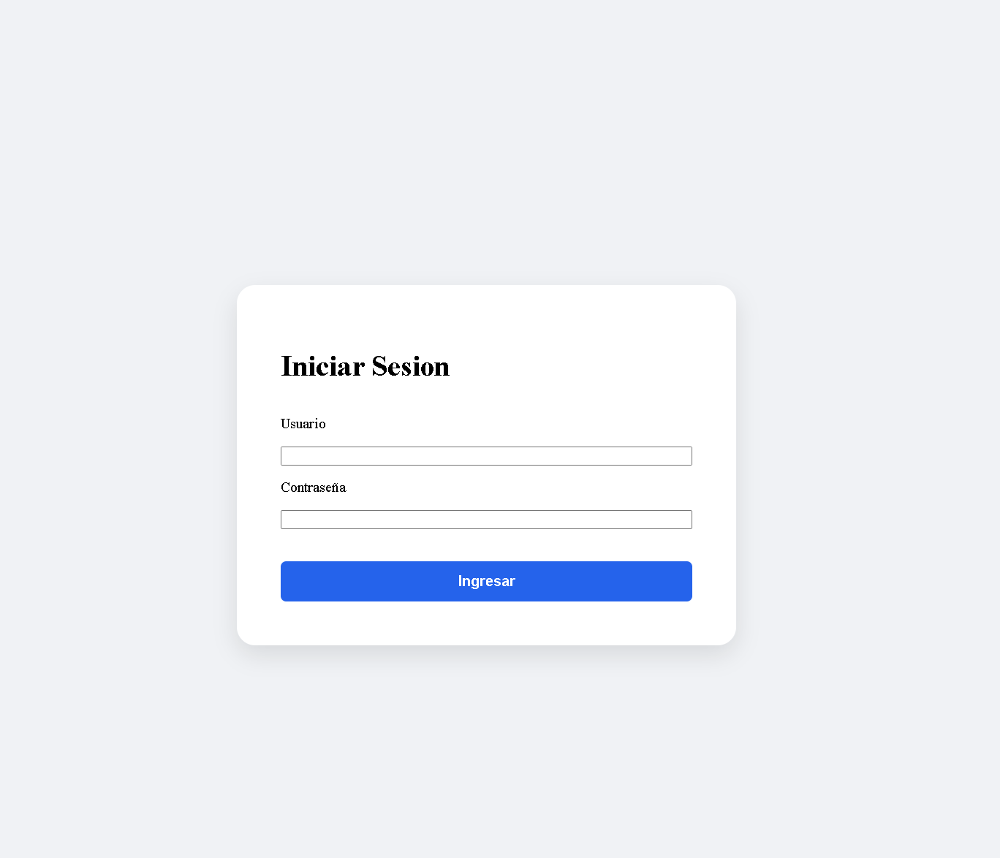
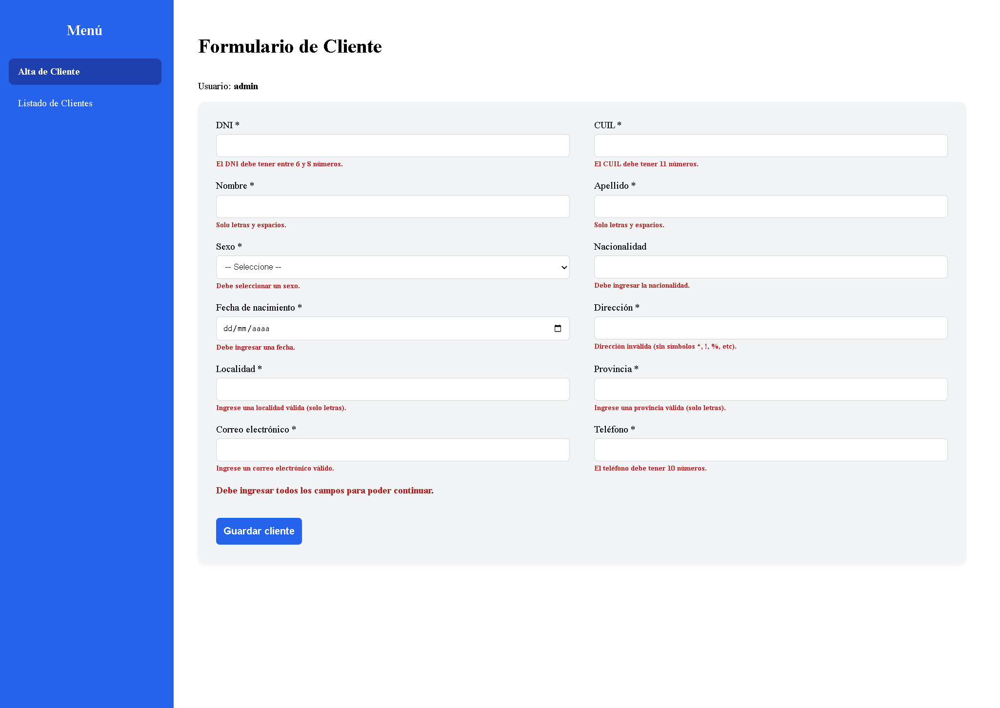
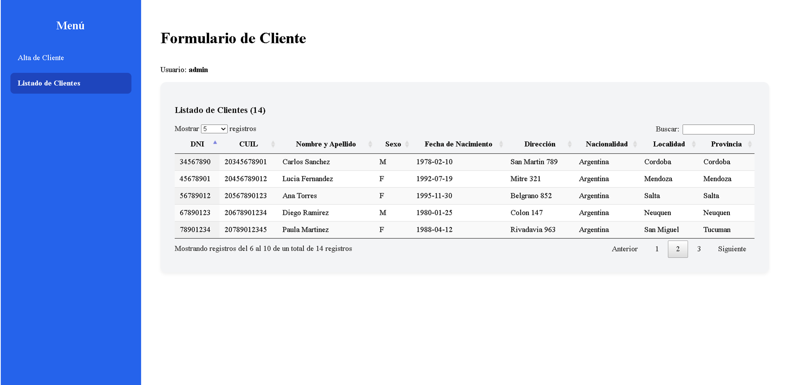

# 🗂️ Sistema de Gestión de Clientes — Java Web (JSP + Servlets)

Aplicación web Java con login, gestión de clientes (alta con validaciones y listado paginado) y manejo de sesión, desarrollada con **arquitectura en capas** sobre **JSP, Servlets y MySQL** vía JDBC.

> Trabajo práctico — Programación IV, UTN Facultad Regional General Pacheco (Grupo 17). Stack solicitado por la cátedra: JSP, Servlets, programación en capas y HTML5, con la lógica en los Servlets.

---

## 🖼️ Vista previa

| Login | Alta de Cliente |
|---|---|
|  |  |

| Listado de Clientes (DataTables) |
|---|
|  |

---

## 🛠️ Stack técnico

| Capa | Tecnología |
|---|---|
| Presentación | JSP, HTML5, CSS, JavaScript; tabla paginada con la librería **DataTables.net** |
| Controlador | **Servlets** (`ServletUsuario`, `ServletAltaCliente`, `ServletListarClientes`) — toda la lógica de control vive acá |
| Negocio | Interfaces (`INegocio`) + implementaciones (`NegocioImpl`) con las reglas de validación |
| Acceso a datos | Interfaces (`IDao`) + implementaciones (`DaoImpl`) con JDBC y `PreparedStatement` |
| Entidades | POJOs (`Usuario`, `Cliente`) mapeados desde la base |
| Base de datos | **MySQL 5.7** (containerizado con Docker), conector `mysql-connector-java 5.1.47` |
| Servidor | Apache Tomcat |

---

## ✨ Funcionalidades

**Login con sesión** — valida usuario y contraseña contra la base; si son correctos guarda el usuario en una variable de sesión (`HttpSession`) que luego se consulta en todas las pantallas para mostrar quién está logueado. Acceso restringido solo a usuarios registrados.

**Alta de clientes con validaciones** — formulario que exige completar todos los campos y valida cada uno:
- DNI: numérico, 6 a 8 dígitos
- CUIL: numérico, 11 dígitos
- Nombre / Apellido / Nacionalidad / Localidad / Provincia: solo letras
- Fecha de nacimiento: no puede ser futura (control calendario)
- Correo electrónico: formato válido y único
- Teléfono: numérico, 10 dígitos

**Listado de clientes** — tabla con todos los registros, **paginada y con búsqueda** mediante DataTables.net.

---

## 🏗️ Decisiones de diseño

- **Arquitectura en capas con inversión de dependencias:** cada capa expone una interfaz (`IUsuarioDao`, `IUsuarioNegocio`) y su implementación. La presentación depende de la abstracción, no de la implementación concreta.
- **Prevención de SQL Injection:** todas las consultas usan `PreparedStatement` con parámetros (`?`), separando el plano de datos del plano de control. Las credenciales del usuario nunca se concatenan en el SQL.
- **Gestión de recursos con try-with-resources:** las conexiones, statements y result sets se cierran automáticamente, evitando fugas de conexión.
- **Validación en dos niveles:** se valida en el front (campos vacíos) antes de invocar la capa de negocio, y nuevamente en negocio/datos.

---

## 🚀 Cómo ejecutarlo

1. **Requisitos:** Eclipse IDE for Enterprise Java, JDK 21, Apache Tomcat, Docker.

2. **Levantar MySQL 5.7 en Docker** (entorno de desarrollo que usa la cátedra):
   ```bash
   docker run --name mysql-prog4 -e MYSQL_ROOT_PASSWORD=root \
     -e MYSQL_DATABASE=sistema_clientes \
     -p 3306:3306 -d mysql:5.7
   ```

3. **Crear las tablas y el usuario de prueba.** Conectarse con Workbench a `localhost:3306` (root / root) y crear la base `sistema_clientes` con las tablas `usuarios` y `clientes`. Insertar un usuario de prueba:
   ```sql
   INSERT INTO usuarios (usuario, contrasena) VALUES ('admin', 'pass');
   ```

4. **Importar el proyecto** en Eclipse y verificar que `mysql-connector-java-5.1.47-bin.jar` (en `WEB-INF/lib`) esté agregado al Build Path y al Deployment Assembly.

5. **Configurar la conexión.** Los datos están en `src/main/java/daoImpl/Conexion.java`:
   ```java
   private String host   = "jdbc:mysql://localhost:3306/";
   private String user   = "root";
   private String pass   = "root";
   private String dbName = "sistema_clientes?useSSL=false";
   ```
   > **Nota sobre las credenciales:** `root / root` son las credenciales del **contenedor Docker de desarrollo** definido en el paso 2 — un entorno desechable y local, no un sistema productivo. Se documentan a propósito para que el proyecto sea reproducible. En un entorno real, estos valores irían en variables de entorno o en un archivo de configuración fuera del control de versiones, nunca en el código.

6. **Ejecutar sobre Tomcat** (Run As → Run on Server). La app abre en `Login.jsp`. Ingresar con `admin` / `pass`.

---

## 👥 Autores

Miguel Angel Lardo — Programación IV, UTN FRGP.
