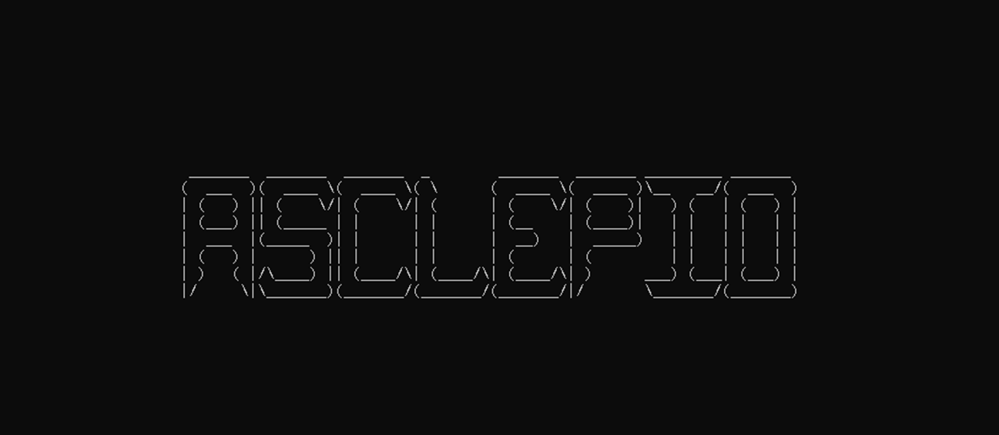
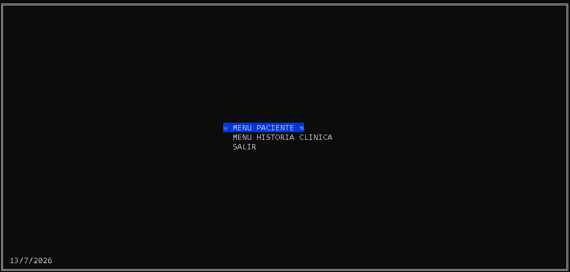
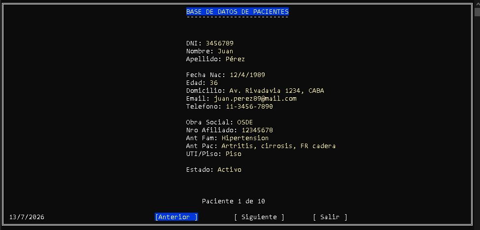
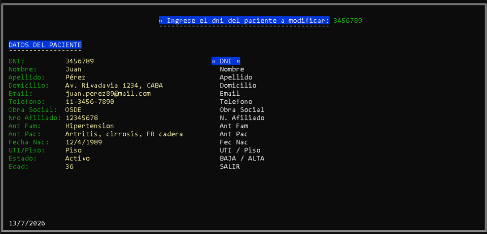
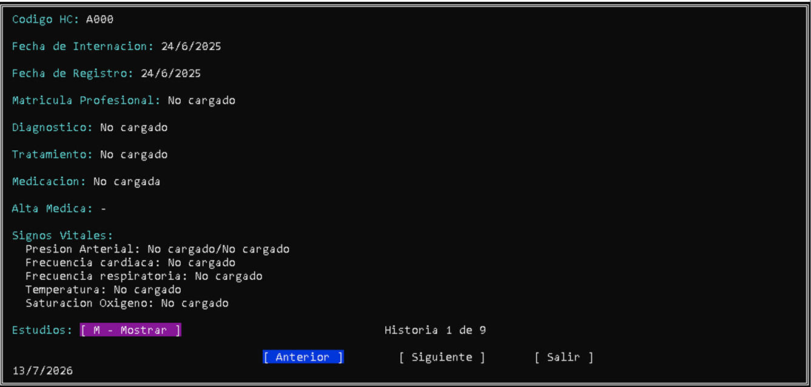
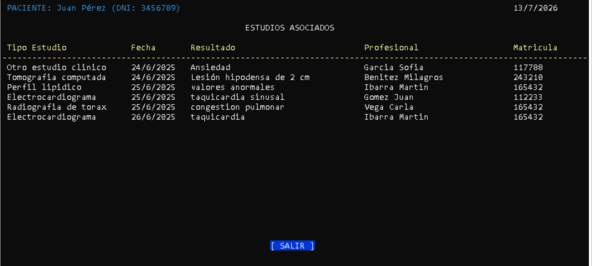

# ⚕️ Asclepio — Sistema de Gestión de Historias Clínicas en C++

Sistema de escritorio para la gestión de **historias clínicas de pacientes**,
desarrollado íntegramente en **C++** con foco en la correcta aplicación de los
paradigmas de la **Programación Orientada a Objetos** y en el uso de
**plantillas genéricas** para máxima reutilización de código.

Proyecto final de la materia **Programación II** — Tecnicatura Universitaria en
Programación, **UTN Facultad Regional General Pacheco (2025)**.



---

## 📸 Vista previa

**Menú principal — navegación por teclado**



**Ficha de paciente — navegación anterior / siguiente**



**Modificación de paciente — datos a la izquierda, campos a editar a la derecha**



**Historia clínica con signos vitales y navegación entre registros**



**Estudios asociados al paciente — relación N:M resuelta con archivo intermedio**



---

## 🎯 Características principales

- **ABM de pacientes y profesionales** con validaciones de negocio (DNI único,
  obra social + número de afiliado sin duplicados, alta / baja lógica).
- **Historias clínicas por paciente**, donde cada archivo `.dat` es el historial
  completo de una persona (el DNI da nombre al archivo).
- **Ciclo clínico completo**: ingreso → internación → registros de evolución →
  alta médica → re-ingreso.
- **Registro de signos vitales** (presión sistólica / diastólica, frecuencia
  cardíaca, frecuencia respiratoria, saturación de oxígeno, temperatura) con
  validación por rango.
- **Estudios complementarios** vinculados a cada registro de historia clínica.
- **Interfaz interactiva en consola** con menús navegables por flechas,
  colores, mensajes de error temporales y validaciones en vivo.

---

## 🏗️ Arquitectura

El proyecto está estructurado en **tres capas** que separan responsabilidades:

```
┌─────────────────────────────────────────────────────────┐
│  Menú / UI              AppMenu, PacienteMenu,          │
│  (rlutil + Disenio)     HistoriaClinicaMenu             │
├─────────────────────────────────────────────────────────┤
│  Manager / Lógica       PacienteManager,                │
│  (reglas de negocio)    HistoriaClinicaManager, ...     │
├─────────────────────────────────────────────────────────┤
│  Archivo / Persistencia PacienteArchivo,                │
│  (TArchivo<T>)          HistoriaClinicaArchivo, ...     │
├─────────────────────────────────────────────────────────┤
│  Modelo                 Persona (abstracta),            │
│  (entidades)            Paciente, Profesional,          │
│                         HistoriaClinica, Fecha, ...     │
└─────────────────────────────────────────────────────────┘
```

**Herencia:** `Persona` (abstracta) → `Paciente` y `Profesional`
comparten DNI, nombre, apellido, domicilio, mail, teléfono.

**Composición:** `HistoriaClinica` se compone de `SignosVitales` + `Fecha`;
`Paciente` contiene `Fecha` de nacimiento.

---

## 🧩 Conceptos técnicos aplicados

### Plantillas genéricas (Templates)

El corazón de la persistencia es `TArchivo<T>`, una clase template que
implementa lectura, escritura, modificación y conteo de registros sobre
archivos binarios `.dat` para **cualquier tipo T**:

```cpp
template <typename Obj>
class TArchivo {
public:
  bool agregarRegistro(Obj reg, std::string nombreArchivo);
  Obj  leer(int pos, std::string nombreArchivo);
  void leer(Obj v[], int cantidadregs, std::string nombreArchivo);
  bool modificar(Obj reg, int pos, std::string nombreArchivo);
  int  getCantidadRegistros(std::string nombreArchivo);
  bool existeArchivo(std::string nombreArchivo);
};
```

De ahí heredan `PacienteArchivo : TArchivo<Paciente>`,
`ProfesionalArchivo : TArchivo<Profesional>`,
`HistoriaClinicaArchivo : TArchivo<HistoriaClinica>` y las tablas
intermedias, evitando repetir la lógica de I/O binario en cada clase.

### Programación Orientada a Objetos

- **Herencia + abstracción:** clase base `Persona` con métodos comunes,
  derivadas `Paciente` y `Profesional` con atributos y comportamiento propios.
- **Composición:** `HistoriaClinica` compuesta por `SignosVitales` y `Fecha`.
- **Sobrecarga de operadores** en `Fecha` (`==`, `<`, `>`) para comparar
  fechas de manera natural.
- **Punteros a métodos miembro** con templates para búsquedas genéricas:
  `buscarPorAtributoPersona(T (Persona::*getter)() const, ...)`.

### Validaciones con expresiones regulares

Función `validarTodoRl` que valida en vivo con `<regex>`:

- **DNI:** 7 u 8 dígitos, no empieza con 0.
- **Email:** patrón `usuario@dominio.tld(.tld2)?`.
- **Teléfono:** con o sin código de país, guiones y espacios.
- **Temperatura:** rango 25.0 – 45.9.
- **Fecha:** formato `DD/MM/AAAA` + validación de días por mes + años bisiestos.

### Interfaz en consola con rlutil

- Menús interactivos con navegación por flechas ↑ ↓ y confirmación con ENTER.
- Posicionamiento absoluto del cursor (`rlutil::locate`) para armar fichas,
  tablas y formularios centrados en pantalla.
- Manejo de colores de texto y fondo por bloque semántico
  (título / clave / valor / error / éxito).
- Mensajes de error temporales que aparecen 1.8 segundos y se auto-borran.

### Gestión de archivos binarios

- Un archivo `.dat` por entidad global (`pacientes.dat`, `profesionales.dat`,
  `estudios.dat`).
- Un archivo `.dat` por paciente para su historia clínica personal
  (`{DNI}.dat`), lo que hace que cada paciente tenga su historial aislado.
- **Generador incremental de códigos de HC** de `A000` a `Z999` (26 000
  registros posibles por paciente), con avance tipo dominó cuando pasa de
  `A999` → `B000`.

---

## 👥 Autoría

Proyecto grupal desarrollado en **UTN FRGP – Programación II (2025)**:

- **Miguel Angel Lardo** (M:29812)
- **Natalia Patricia Mucci** (M:30490)
- **Ella Lo Re Mansilla** (M:28232)

**Diseño arquitectónico e implementación principal:** Miguel Angel Lardo.

- Template genérico `TArchivo<T>` y arquitectura en capas Modelo / Manager / Archivo.
- Sistema de menús interactivos con navegación por teclado y centrado dinámico.
- Módulo de validaciones (`validarTodoRl`, `validarFechaRl`) con expresiones regulares.
- Clase `Fecha` con operadores sobrecargados y detección de años bisiestos.
- Generador incremental de códigos de historia clínica (`A000` → `Z999`).
- Lógica de estados clínicos: ingreso, internación, alta médica, re-ingreso, baja lógica.

**Contribuciones del equipo:** partes de la clase `Persona` y del módulo de
`Estudios` construidas sobre los métodos e interfaces del diseño principal.

---

## 🛠️ Cómo compilar

**Con Code::Blocks** (recomendado, el proyecto trae `HC Electronicas.cbp`
listo):

1. Abrir `HC Electronicas.cbp` en Code::Blocks.
2. **Project → Build options → Compiler settings → Compiler Flags**
   tildar `-std=c++14` (necesario para evitar el conflicto de `byte` con GCC 14+).
3. **F9** para compilar y ejecutar.

**Con g++ desde consola:**

```bash
g++ -std=c++14 *.cpp -o asclepio
./asclepio
```

---

## 📂 Estructura del proyecto

```
UTN_PROYECTO_LAB2/
├── main.cpp                        # Entry point
├── AppMenu.{h,cpp}                 # Menú raíz
├── PacienteMenu.{h,cpp}            # Submenú Paciente
├── HistoriaClinicaMenu.{h,cpp}     # Submenú HC
├── PacienteManager.{h,cpp}         # Lógica de negocio (Paciente)
├── HistoriaClinicaManager.{h,cpp}  # Lógica de negocio (HC)
├── ProfesionalManager.{h,cpp}      # Lógica de negocio (Profesional)
├── EstudiosManager.{h,cpp}         # Lógica de estudios
├── EstudiosXHistoriaClinicaManager.{h,cpp}
├── ProfesionalXPacienteManager.{h,cpp}
├── TemplateArchivo.h               # 🔷 TArchivo<T> — núcleo genérico
├── PacienteArchivo.{h,cpp}         # : TArchivo<Paciente>
├── ProfesionalArchivo.{h,cpp}      # : TArchivo<Profesional>
├── HistoriaClinicaArchivo.{h,cpp}  # : TArchivo<HistoriaClinica>
├── EstudiosArchivo.{h,cpp}
├── EstudiosXHistoriaClinicaArchivo.{h,cpp}
├── ProfesionalXPacienteArchivo.{h,cpp}
├── Persona.{h,cpp}                 # Clase base abstracta
├── Paciente.{h,cpp}                # : Persona
├── Profesional.{h,cpp}             # : Persona
├── HistoriaClinica.{h,cpp}
├── SignosVitales.{h,cpp}
├── Estudios.{h,cpp}
├── EstudiosXHistoriaClinica.{h,cpp}
├── ProfesionalXPaciente.{h,cpp}
├── Fecha.{h,cpp}                   # Fecha con operadores sobrecargados
├── Enum.{h,cpp}
├── Validaciones.{h,cpp}            # validarTodoRl, validarFechaRl, etc.
├── Disenio.{h,cpp}                 # UI: marcos, menús, centrado, colores
├── rlutil.h                        # Librería externa (control de consola)
├── docs/                           # Capturas para documentación
└── *.dat                           # Archivos de datos binarios
```

