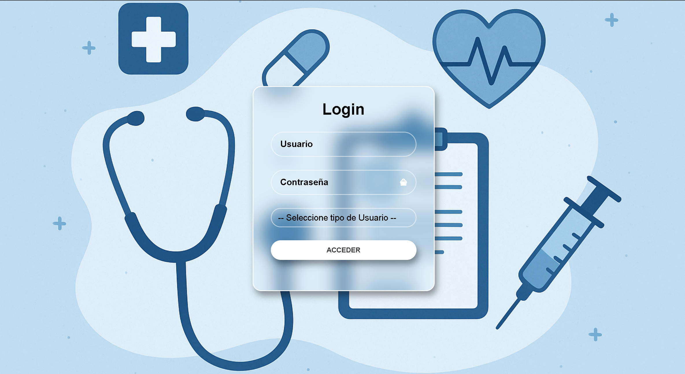
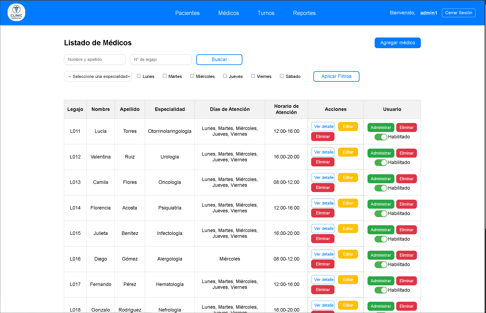
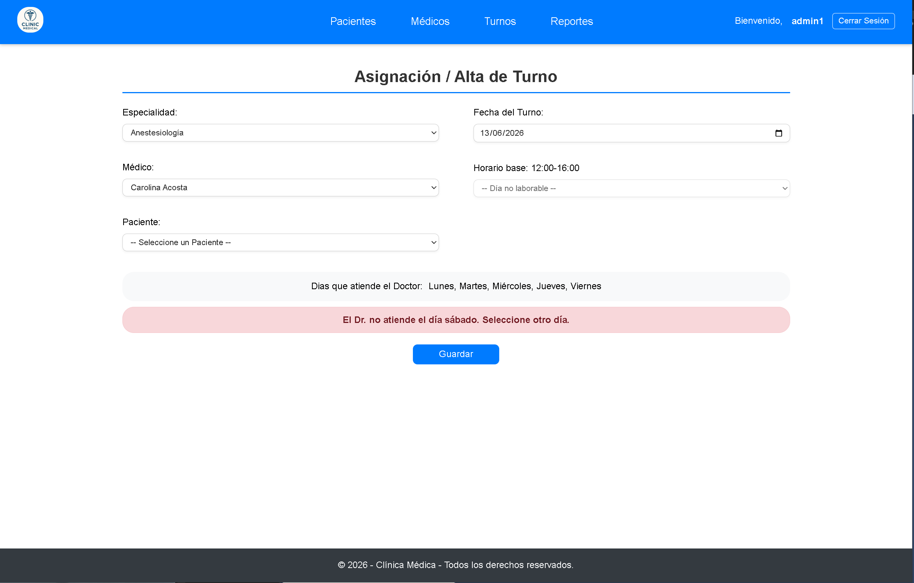
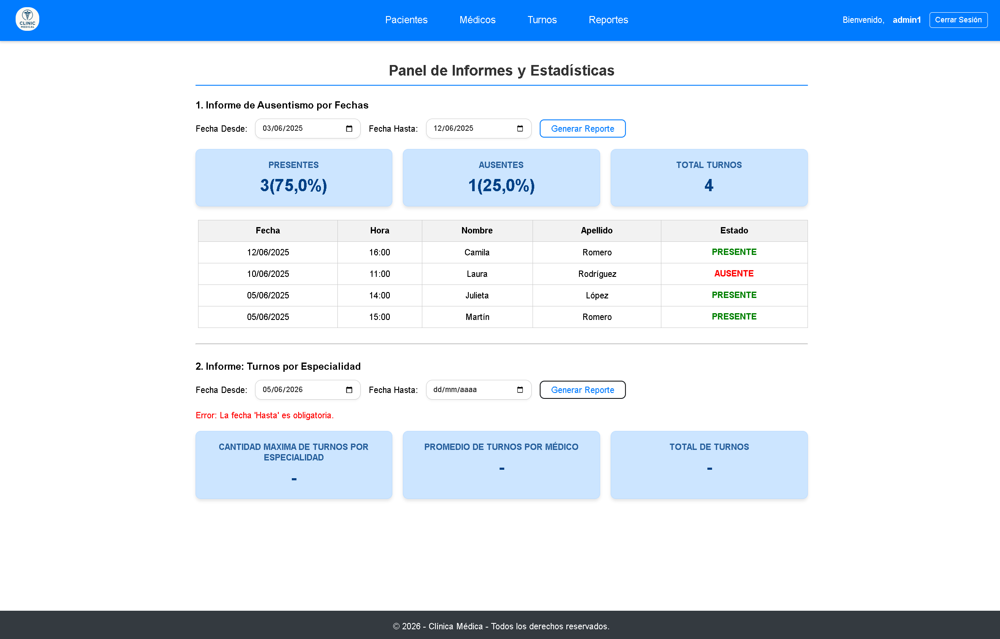
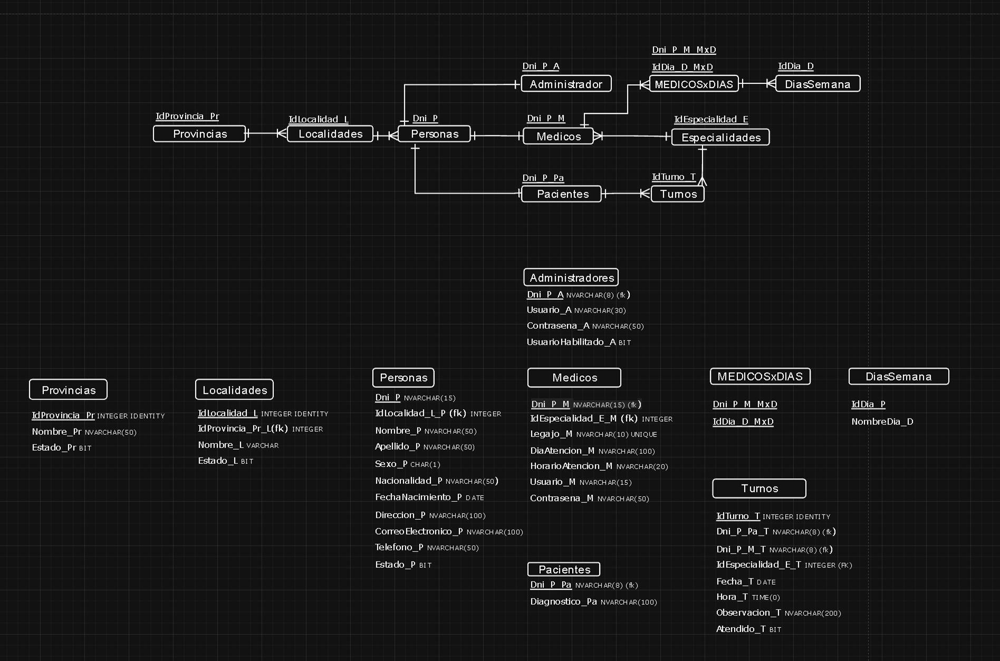
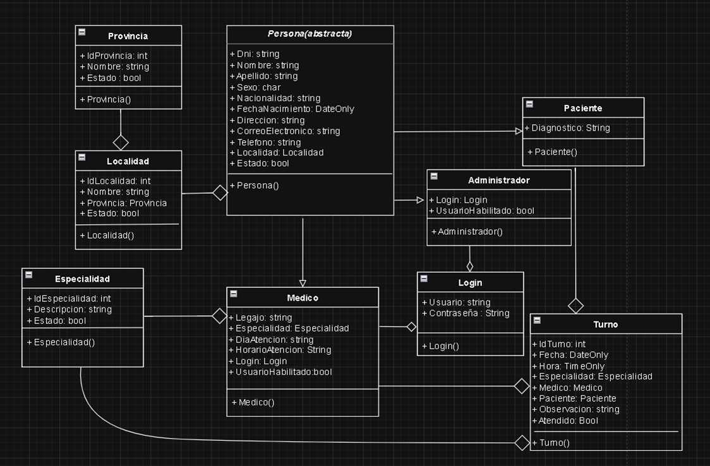

# 🏥 Sistema de Gestión de Turnos para Clínica Médica

Aplicación web para administrar pacientes, médicos y turnos de una clínica, con dos roles de usuario (**Administrador** y **Médico**), desarrollada con **arquitectura en 3 capas** sobre **ASP.NET WebForms y SQL Server**.

> Trabajo práctico integrador final — Programación III, UTN Facultad Regional General Pacheco (Grupo 4, 2025).

---

## 🖼️ Vista previa

| Login | Listado de Médicos |
|---|---|
|  |  |

| Asignación de Turnos | Panel de Informes |
|---|---|
|  |  |

**Diagrama Entidad-Relación:**



**Diagrama UML:**



---

## 🛠️ Stack técnico

| Capa | Tecnología |
|---|---|
| Presentación (`Vista`) | ASP.NET WebForms (.NET Framework 4.8), HTML, CSS, JavaScript (validaciones cliente) |
| Negocio (`Negocio`) | C# — reglas de negocio, lógica de turnos e informes |
| Acceso a datos (`Dao`) | C# + ADO.NET (`SqlConnection`, `SqlCommand`, consultas parametrizadas) |
| Entidades (`Entidades`) | POCOs compartidas entre capas |
| Base de datos | SQL Server 2022 (containerizado con Docker en desarrollo) — script de creación en [`Documentacion/script bbdd.txt`](Documentacion/script%20bbdd.txt) |

Las localidades, provincias, especialidades y el usuario administrador inicial vienen precargados por script, para que el sistema sea reproducible en cualquier entorno.

---

## ✨ Funcionalidades

### 🔹 Administrador

**ABML de Pacientes** — alta, baja lógica, modificación y listado con filtros. Cada paciente registra: DNI, nombre, apellido, sexo, nacionalidad, fecha de nacimiento, dirección, localidad, provincia, correo electrónico y teléfono.

**ABML de Médicos** — además de los datos personales, cada médico tiene legajo, especialidad (una sola por médico), días y horarios de atención, y usuario/contraseña del sistema editables.

**Asignación de Turnos** — selección encadenada de especialidad → médico → día → horario → paciente, con reglas de negocio:
- Cada turno dura 1 hora
- Un médico no puede tener dos turnos el mismo día a la misma hora (el sistema solo ofrece horarios disponibles)

**Informes procesados** — no simples listados: por ejemplo, presentismo entre dos fechas (% de presentes y ausentes con detalle de pacientes) y ranking de médicos con más turnos.

### 🔹 Médico

**Visualización de turnos propios** — listado con paciente, fecha y horario, con filtros y búsqueda.

**Registro de presentismo** — marca Presente/Ausente por turno y agrega observaciones de la consulta.

### 🔐 Transversal

- Login con roles diferenciados; el nombre del usuario logueado se muestra en todas las pantallas
- Validaciones en cliente (JavaScript) y en servidor (C#)
- Consultas con `SqlParameter` en toda la capa de datos para prevenir SQL Injection

---

## 🚀 Cómo ejecutarlo

1. **Requisitos:** Visual Studio 2022, SQL Server (Express o superior), .NET Framework 4.8.
2. Clonar el repositorio y abrir `TPINT_GRUPO_4_PR3.sln`.
3. Levantar SQL Server. Puede ser una instalación local o un container Docker (así corre en el entorno de desarrollo del proyecto):
   ```bash
   docker run -e "ACCEPT_EULA=Y" -e "MSSQL_SA_PASSWORD=TuPasswordSegura123" \
     -e "MSSQL_PID=Express" -e "TZ=America/Buenos_Aires" \
     -p 1433:1433 --name SQLServer2022 -d mcr.microsoft.com/mssql/server:2022-latest
   ```
4. Ejecutar el script [`Documentacion/script bbdd.txt`](Documentacion/script%20bbdd.txt) en SQL Server: crea la base `Clinica` con los datos maestros precargados.
5. Configurar la cadena de conexión en `Vista/Web.config`:
   ```xml
   <connectionStrings>
     <add name="Clinica"
          connectionString="Data Source=localhost;Initial Catalog=Clinica;Integrated Security=True;Encrypt=False"
          providerName="System.Data.SqlClient" />
   </connectionStrings>
   ```
   > Si SQL Server corre en Docker (container Linux), usar autenticación SQL en lugar de Windows: `Data Source=localhost;Initial Catalog=Clinica;User ID=sa;Password=TuPasswordSegura123;Encrypt=False`
6. Establecer `Vista` como proyecto de inicio y ejecutar (F5).

---

## 📐 Decisiones de diseño

- **Separación estricta en 3 capas** con proyectos independientes: la presentación nunca accede a la base de datos; toda operación pasa por Negocio → Dao.
- **Consultas parametrizadas** en toda la capa de datos para evitar inyección SQL.
- **Baja lógica** en lugar de eliminación física, preservando integridad referencial e historial de turnos.
- **Datos maestros por script** (provincias, localidades, especialidades) para garantizar entornos reproducibles.

---

## 👥 Autores

Grupo 4 — Programación III, UTN FRGP (2025).
